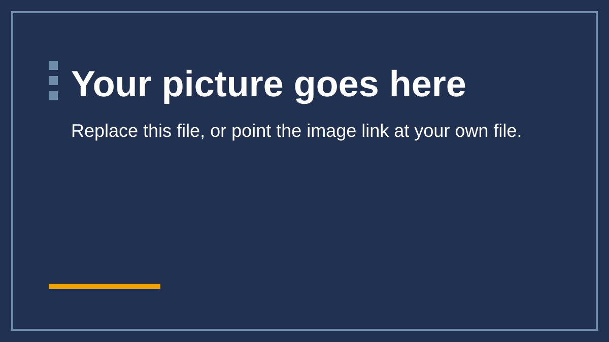

---
# Copy this file, rename the copy (for example 04-my-topic.qmd), and change the
# title. This file itself is not built into the website because its name
# starts with an underscore.
title: "Chapter title"
subtitle: "One line saying what the learner gets from this chapter"
---

::: {.objectives}
**In this chapter**

- First objective, starting with a verb the learner can be tested on
- Second objective
- Third objective
:::

## First section

Explain one idea in a few short paragraphs. Say the point first.

::: {.keypoint}
**Key point**

The one thing to remember from this section.
:::

## Second section

Continue with the next idea. Add a picture, a table or a diagram if it helps:

{fig-alt="Describe what the picture shows and why it is there."}

## Check your understanding

::: {.quiz-score}
:::

::: {.question}
Question text that tests the first objective?

- [ ] A plausible wrong answer
- [x] The correct answer
- [ ] Another plausible wrong answer

::: {.feedback}
Explain why the right answer is right, and why the tempting wrong one is not.
:::
:::
